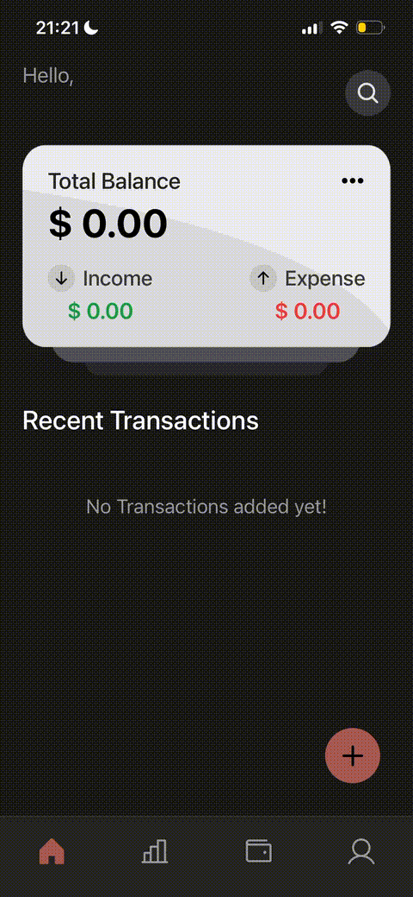
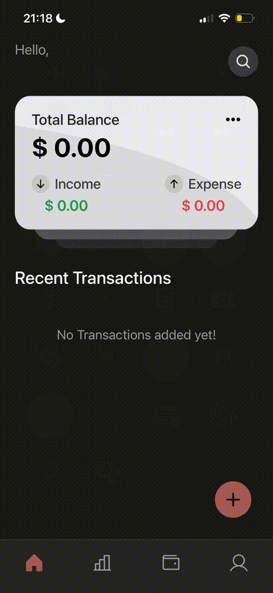
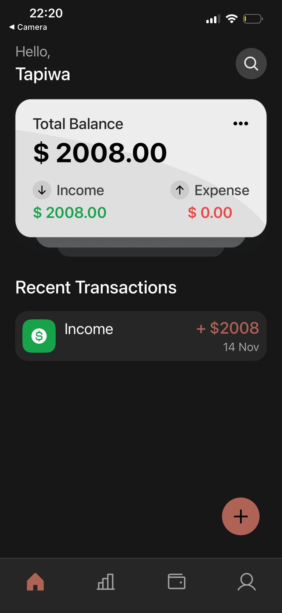
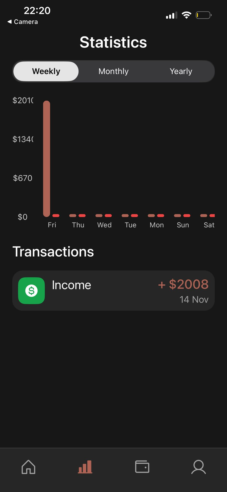
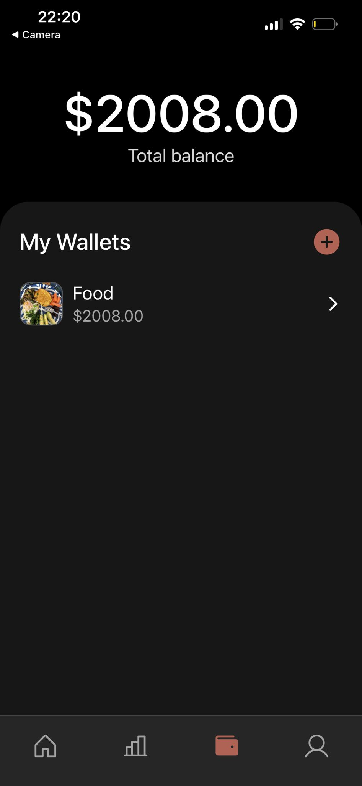

# Student Budgeting App

A mobile budgeting application designed to help students track income, expenses, and financial habits through a simple and intuitive interface.

The app allows users to create wallets, log transactions, and visualize spending patterns through charts. The goal of the project is to make personal finance management easier and more approachable for students who may not use traditional budgeting tools.

---

# Figma Prototype

The user interface and interaction flow were first designed in **Figma** before the application was implemented.

Figma Prototype:  
https://www.figma.com/proto/mpVYAm3RdH9bdWitSvneGZ/Budgeting-app?node-id=10-386&t=5zO1lJ4JduwrWhXZ-1

Use the navigation bar buttons to move between screens and the **"+" button** to add transactions.

---

# Application Preview

Below are short previews demonstrating the main interactions of the application.

<div align="center">
<table>
<tr>
<td align="center">
<br>
Main Application Flow
</td>

<td align="center">
<br>
User Login
</td>

<td align="center">
<br>
Adding a Wallet
</td>
</tr>
</table>
</div>

These previews demonstrate how users navigate the application, authenticate their accounts, and create wallets to manage their finances.

---

# Screenshots

## Dashboard

The dashboard serves as the main landing page of the application. It provides users with an overview of their financial status, including total balance, income, expenses, and recent transactions. This view allows users to quickly understand their financial situation without navigating through multiple screens.

<p align="center">

</p>

---

## Statistics

The statistics page provides visual insights into spending behavior. Charts display weekly, monthly, or yearly spending trends, allowing users to analyze their financial habits and identify patterns in their income and expenses.

<p align="center">

</p>

---

## Wallet Management

The wallet screen allows users to create and manage different wallets for organizing their finances. Each wallet can represent a category such as food, savings, or personal spending. This feature helps users keep their financial data structured and easy to manage.

<p align="center">

</p>

---

# Features

- Secure user authentication
- Dashboard displaying balance, income, and expenses
- Wallet creation and management
- Add income and expense transactions
- Spending analytics through charts
- Transaction search functionality
- Profile editing with avatar uploads
- Real-time financial updates

---

# Technology Stack

### Frontend

- React Native
- Expo
- React Native Gifted Charts
- Expo Image Picker

### Backend

- Firebase Authentication
- Firebase Firestore Database

### Media Storage

- Cloudinary (used for profile image uploads)

---

# Installation

Make sure your system supports **React Native and Expo development**.

### Requirements

- Node.js  
  https://nodejs.org

Recommended tools:

- VS Code
- Expo Go mobile app
- Xcode (optional for iOS simulator)
- Android Studio (optional for Android emulator)

---

# Setup

Clone the repository:

```bash
git clone https://github.com/tapiwa-ce/Finance-App.git
cd project-folder

npm install
npm install --save react-native-size-matters
npm install firebase
npm install phosphor-react-native
npm install @react-native-async-storage/async-storage
npx expo install expo-image
npx expo install expo-image-picker
npm install axios
npx expo install @shopify/flash-list
npm install react-native-element-dropdown
npm install @react-native-community/datetimepicker
npm install @react-native-segmented-control/segmented-control
npm install react-native-gifted-charts
npm install expo-linear-gradient
```

## API Configuration

For security reasons, **Firebase and Cloudinary API keys have been removed from this repository**.

To run the application you must create your own credentials.

---

## Firebase Setup

1. Go to https://firebase.google.com
2. Create a new Firebase project
3. Enable the following services:

- Firebase Authentication
- Firestore Database

4. Replace the Firebase configuration inside the project with your own credentials.

---

## Cloudinary Setup

1. Create an account at https://cloudinary.com
2. Generate your API credentials
3. Replace the Cloudinary configuration used for profile image uploads.

---

## Running the App

Start the Expo development server:

```bash
npx expo start
```

### Running on a Mobile Device

1. Install **Expo Go** from the App Store or Google Play.
2. Ensure your phone and computer are connected to the **same Wi-Fi network**.
3. Scan the QR code displayed in the terminal.
4. The application will launch automatically inside **Expo Go**.
